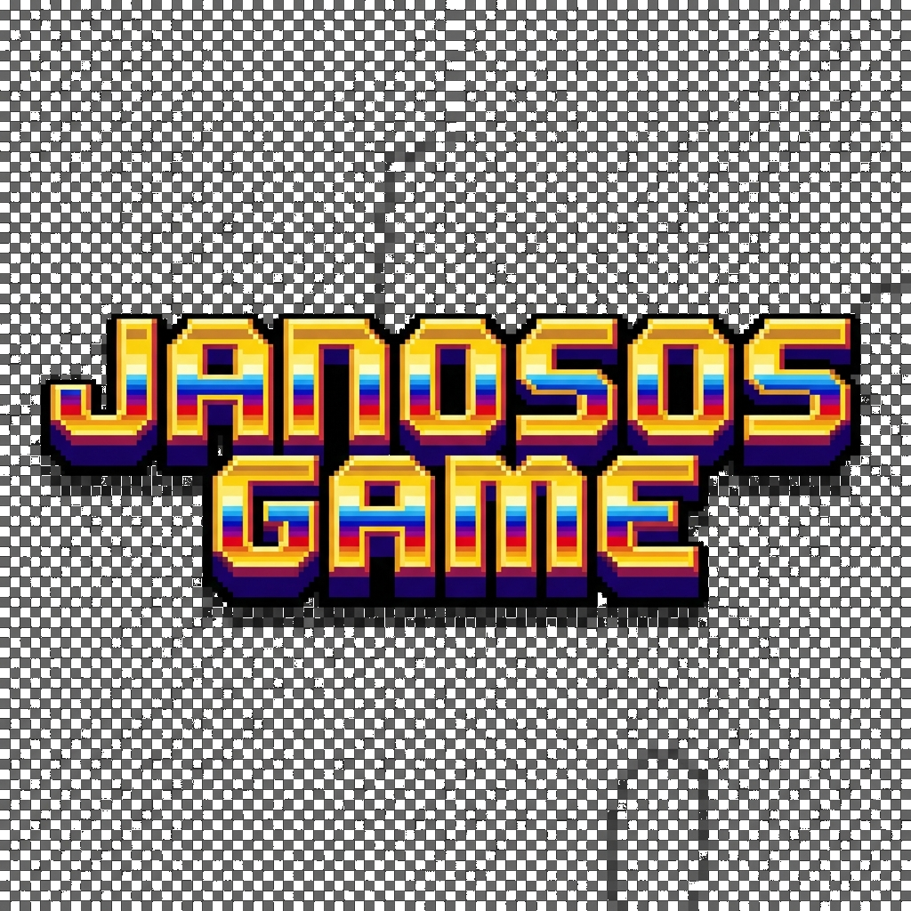

# Janosos Game 🦖

Un emocionante juego de "endless runner" estilo retro, creado con tecnología moderna.



## 🛠️ Tecnologías Utilizadas

Este proyecto ha sido desarrollado utilizando:

*   **[Flutter](https://flutter.dev/)**: El framework de UI de Google para crear aplicaciones compiladas nativamente.
*   **[Flame Engine](https://flame-engine.org/)**: Un motor de juegos 2D minimalista que se ejecuta sobre Flutter, proporcionando el bucle de juego, sistema de componentes (FCS), colisiones y física básica.

## 🎮 Características (Versión V3)

*   **Multijugador Local / Selección de Personajes**: Juega con 6 personajes únicos (Jano, Parker, Chema, Conra, Shyno, Nakama).
*   **Habilidades Únicas**:
    *   *Jano*: Disparo destructor de obstáculos.
    *   *Parker*: Vida extra (escudo pasivo).
    *   *Chema*: Tanque con escudo regenerativo (con penalización de puntos).
    *   *Conra*: Invisibilidad temporal.
    *   *Shyno*: Doble salto.
    *   *Nakama*: Planeo/Gravedad Zero.
*   **Estética Retro**: Gráficos pixel art 16-bit, incluyendo UI personalizada y fondos animados.
*   **Sistema de Vidas y Puntuación**: HUD dinámico con indicadores de salud y cooldowns.

## 🎵 Novedades Version V4

*   **Sistema de Audio Completo**:
    *   Música de fondo en loop (`LoopSong`).
    *   Efectos de sonido para salto, selección, disparo, invisibilidad y daño.
*   **Corrección de Bugs**:
    *   Solución al problema de reproducción de audio en Windows.
    *   Optimización de assets para transparencia (Versión Label V4).

## 🚀 Cómo Ejecutar

Asegúrate de tener Flutter instalado y configurado ó juega [aquí.](https://janosos.github.io/Janosos_Game/)

```bash
# Obtener dependencias
flutter pub get

# Ejecutar en Windows
flutter run -d windows

# Ejecutar en Android
flutter run -d android
```

## 📂 Estructura del Proyecto

*   `lib/game`: Contiene la lógica del juego (Componentes, HUD, Física).
*   `assets/images`: Sprites y recursos gráficos.

---
*Desarrollado para la comunidad Janosos.*
